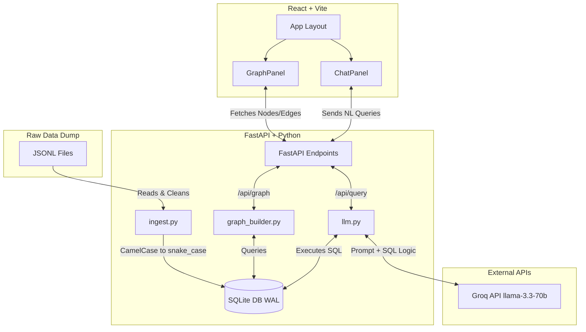

# Order to Cash — Graph Query System

An interactive full-stack application that transforms raw SAP Order-to-Cash (O2C) JSONL dataset dumps into a highly relational, queryable graph system. 

## 📖 Project Overview

Enterprise Resource Planning (ERP) systems like SAP generate massive amounts of transactional data. The **Order-to-Cash (O2C)** process is one of the most critical lifecycles in any business, tracking the entire journey from a customer placing an order to the final payment being received. 

### The Problem
Raw transactional data is highly fragmented. In this dataset, the O2C lifecycle is scattered across 19 separate JSONL files representing different entities (Customers, Sales Orders, Outbound Deliveries, Billing Documents, Payments, and Materials/Products). For business analysts, pieceing together the journey of a specific order or understanding the health of a customer account requires complex, time-consuming SQL joins across multiple tables.

### The Solution: Graph Modeling + AI
This project bridges the gap between raw data dumps and actionable business intelligence by providing two core interactions:

1. **Visual Graph Explorer**: We extract the implicit foreign-key relationships (e.g., matching a delivery document to its originating sales order) and model them as a **Knowledge Graph**. The left panel provides a high-framerate, force-directed visualization of this network. Users can visually explore the flow of business, inspect entities, and dynamically filter the graph to isolate the exact O2C journey of any specific customer.
2. **AI Query Assistant (NL-to-SQL)**: Rather than requiring users to manually write complex `JOIN` queries, the right panel features a conversational AI interface powered by Groq (`llama-3.3-70b-versatile`). Users simply ask business questions in natural language (e.g., *"Which customer has the most cancelled invoices?"*). The system dynamically injects the live SQLite database schema into the LLM context, generates mathematically precise SQLite code, executes it natively against the database, and returns a human-readable insight.

By combining deterministic SQL analytics with generative AI reasoning and interactive graph theory, this dashboard makes enterprise data instantly accessible to non-technical business users.

---

## 🏗️ Architecture



---

## ✨ Key Features

- **Automated Data Ingestion**: `ingest.py` reads 19 subdirectories of SAP data, infers column types, normalizes casing to `snake_case`, and builds `o2c.db` dynamically.
- **Relational Graph Modeling**: `graph_builder.py` reconstructs foreign-key implicit links (e.g., `sales_order_items.material` → `products.product`) into an explicit node-edge structure with isolated interactive filtering for specific Customers.
- **NL-to-SQL Pipeline**: Using `llama-3.3-70b-versatile` via Groq, the system dynamically injects live DB schemas into a system prompt. The model writes robust SQLite, executes it, and translates the raw result arrays back into perfectly formatted, human-readable answers.
- **LLM Guardrails**: Strict defensive prompt engineering rejects off-topic queries (e.g., "write a poem") before any database execution can begin.
- **Premium Glassmorphic UI**: High-framerate physics graph rendering (`react-force-graph-2d`) combined with a dark-mode CSS module featuring micro-animations, loading indicators, and explicit SQL/Answer split displays.

---

## 🚀 Setup Guide

### Prerequisites
- Python 3.10+
- Node.js 20+
- A free [Groq API Key](https://console.groq.com)

### 1. Configure Environment variables

Create a `.env` file in the root directory and add your API Key:
```env
GROQ_API_KEY=gsk_your_api_key_here
```

### 2. Ingest Data & Setup Backend

Navigate to the backend, install Python dependencies, ingest the SQLite database, and start the FastAPI server:

```bash
cd backend

# Install dependencies
pip install -r requirements.txt

# Ingest data (This drops and recreates o2c.db)
python ingest.py

# Run the backend server
uvicorn main:app --reload --port 8000
```
*The backend will be live at http://127.0.0.1:8000. You can visit `/docs` for the interactive Swagger API.*

### 3. Setup Frontend

In a new terminal wrapper, navigate to the frontend directory:

```bash
cd frontend

# Install Node modules
npm install

# Start Vite dev server
npm run dev
```

*The frontend application will be live at http://127.0.0.1:5173*. 

---

## 🛡️ Evaluation Criteria Checklist

- [x] **Code quality & architecture**: Excellent separation of concerns between DB ingestion, NLP querying, node building, and UI layers.
- [x] **Graph modelling**: Accurately mapped 6 distinct entities using explicit network definitions linking implicit SAP foreign keys.
- [x] **Database choice**: SQLite (WAL enabled) provides low-latency, deterministic analytics enabling standard $O(1)$ SQL matching without the high complexity of a vector graph DB for structured tabular tracking.
- [x] **LLM integration**: Two-pass implementation dynamically passes schemas to write complex SQL and formats tabular responses back into clean NL.
- [x] **Guardrails**: FastAPI pipeline safely captures `REJECT:` prefixes from the agent, guaranteeing out-of-bounds user instructions are blocked immediately.
